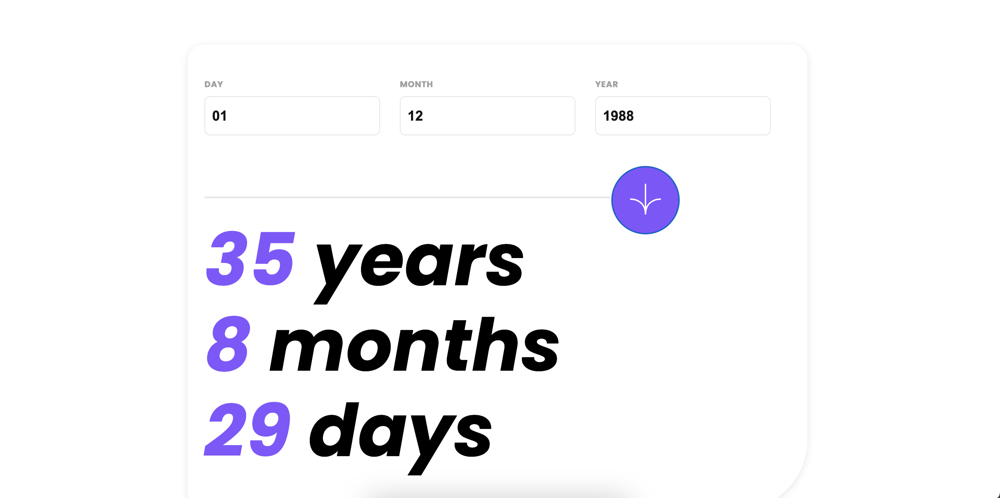

# Frontend Mentor - Age calculator app solution

This is a solution to the [Age calculator app challenge on Frontend Mentor](https://www.frontendmentor.io/challenges/age-calculator-app-dF9DFFpj-Q).

## Table of contents

- [Frontend Mentor - Age calculator app solution](#frontend-mentor---age-calculator-app-solution)
  - [Table of contents](#table-of-contents)
  - [Overview](#overview)
    - [The challenge](#the-challenge)
    - [Screenshot](#screenshot)
    - [Links](#links)
  - [My process](#my-process)
    - [Built with](#built-with)
    - [What I learned](#what-i-learned)
    - [Continued development](#continued-development)
  - [Author](#author)
  - [Acknowledgments](#acknowledgments)

## Overview

### The challenge

Users should be able to:

- View an age in years, months, and days after submitting a valid date through the form
- Receive validation errors if:
  - Any field is empty when the form is submitted
  - The day number is not between 1-31
  - The month number is not between 1-12
  - The year is in the future
  - The date is invalid e.g. 31/04/1991 (there are 30 days in April)
- View the optimal layout for the interface depending on their device's screen size
- See hover and focus states for all interactive elements on the page

### Screenshot

### Links

- Solution URL: [github](https://github.com/klgh/frontend-friday-09)
- Live Site URL: [https://steady-praline-13ed9c.netlify.app/](https://steady-praline-13ed9c.netlify.app/)

## My process

### Built with

This project was generated with [Angular CLI](https://github.com/angular/angular-cli) version 18.2.2.

- Flexbox
- Mobile-first workflow
- [Angular](https://angular.dev/)

### What I learned

It was fun to quickly get this site up and running

### Continued development

Update the inital form state

## Author

- Website - [kaleigh.dev](https://kaleigh.dev/)
- Frontend Mentor - [@klgh](https://www.frontendmentor.io/profile/klgh)

## Acknowledgments

👑 Frontend Queens
